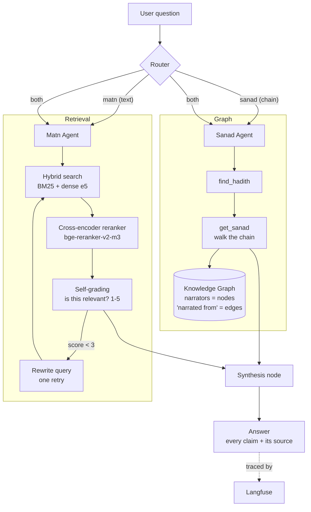

# مُسنَد · Musnad

**Agentic GraphRAG for Hadith verification.** Musnad answers questions from Sahih Muslim with the exact hadith reference, and traces each hadith's chain of transmission (*isnād*) narrator by narrator — attaching every narrator's grading from the classical biographical-criticism literature (*al-jarḥ wa-l-taʿdīl*), each claim cited to its source.

> «مُسنَد» نظام بيجاوب على أسئلة من **صحيح مسلم** بمصدرها ورقم الحديث، وبيتتبّع **سند** الحديث راوي راوي مع **حكم الجرح والتعديل** لكل راوٍ وبمصدره. المتون في قاعدة بيانات متجهات، والأسانيد في **جراف معرفي** — فأسئلة زي «مين روى الحديث ده وإيه أحكام العلماء على رواته؟» بقى ليها إجابة موثّقة.

---

## Why this is not a standard RAG system

Retrieval over hadith text can tell you *what* a hadith says. It cannot tell you *who transmitted it* or *whether those transmitters were considered reliable* — that information does not live in the text at all. It lives in the **structure of the chain**, and in a separate corpus of narrator biographies.

Musnad models both: the texts (*mutūn*) as vectors, the chains (*asānīd*) as a knowledge graph where narrators are nodes and "narrated from" is an edge.

| Question | Vector-only RAG | Musnad |
|---|---|---|
| "What do the hadiths say about intention?" | Works | Works |
| "Which book contains *innamā al-aʿmāl bi-l-niyyāt*?" | Unreliable | Answered via metadata filter |
| "Who narrated hadith #4, and how did the critics grade each one?" | Fails or hallucinates | Answered from the graph, with sources |

That third row is the reason the project exists.

---

## Architecture



A router classifies each question and dispatches it to one or both specialised agents, orchestrated as a **LangGraph** state machine with checkpointed conversation memory. A synthesis node merges their outputs under strict grounding constraints.

The same two capabilities — `search_hadith` and `check_sanad` — are also exposed as an **MCP server**, so any MCP-compatible client can use Musnad as a tool.

---

## Technical design decisions

**The hadith is the retrieval unit.** No fixed-size chunking. A hadith is already a coherent semantic unit, and blind character-window splitting severs the *isnād* from the text it authenticates. Three representations were compared empirically — *matn* only, *isnād* + *matn*, and chapter-title + *matn* — and the winner was chosen on measured retrieval quality, not intuition.

**Index without diacritics, display with them.** The corpus mixes vocalised and unvocalised copies of the same text. Diacritics (*tashkīl*) shift embeddings and fragment BM25 tokenisation, so the search layer normalises them away while the response renders the original vocalised text.

**Refusal over fallback.** There is deliberately no web-search escape hatch. When an answer is not present in the approved sources, the system states that plainly rather than reaching for the open internet. In this domain an explicit refusal is both more scholarly and more defensible engineering than a fluent guess.

**Surface ambiguity, never resolve it silently.** Narrator names collide across generations. When a name matches multiple people, Musnad presents the candidates with their *ṭabaqa* rather than picking one. A narrator with no recorded grading returns "not found in the sources" — the system never invents one.

**Hybrid retrieval with reranking.** Hadith queries mix conceptual questions, where dense retrieval wins, with exact-phrase and proper-name lookups, where lexical search wins. BM25 and dense results are fused with Reciprocal Rank Fusion, then a multilingual cross-encoder reranks the top 20 down to the final context.

**Entity resolution across sources is measured, not assumed.** Narrator names in the chain dataset do not match the biographical dataset character-for-character. A normalisation pass (definite article, hamza forms, honorifics) drives the match, and the achieved match rate is recorded alongside the unmatched remainder rather than hidden.

---

## Evaluation

The system is measured against a **golden dataset of hand-reviewed question / answer / source triples**, scored with RAGAS (`faithfulness`, `answer_relevancy`, `context_precision`), a purpose-written LLM-as-judge, and manually verified `hit@5`.

A third of the questions are deliberately hard or **unanswerable from the sources** — a system that abstains at the right moment scores higher here than one that improvises.

| Stage | hit@5 | faithfulness | Narrator questions |
|---|---|---|---|
| Dense retrieval only | — | — | 0% |
| Hybrid + reranking | — | — | 0% |
| Agentic + knowledge graph | — | — | —% |

Full setups and per-experiment numbers are in [`EXPERIMENTS.md`](EXPERIMENTS.md).

The final column is the headline result: questions that were structurally impossible for a text-only system become answerable — through the knowledge graph, not through a larger model.

---

## Tech stack

| Layer | Choice |
|---|---|
| Embeddings | `intfloat/multilingual-e5-base` |
| Reranking | `BAAI/bge-reranker-v2-m3` (cross-encoder) |
| Lexical retrieval | BM25 + Reciprocal Rank Fusion |
| Vector store | ChromaDB (HNSW, cosine) |
| Knowledge graph | NetworkX |
| Orchestration | LangGraph |
| Generation | Groq (Llama) · Google Gemini |
| Observability | Langfuse |
| Interoperability | MCP server (FastMCP) |
| Interface | Gradio |

---

## Data

| Path | Contents | Source |
|---|---|---|
| `data/raw/muslim.json` | Sahih Muslim — 57 books, 7,459 hadiths, Arabic text with bilingual metadata | `hadith-json` |
| `data/isnad/` | Multi-IsnadSet (MIS) — pre-extracted narrator chains | MIS dataset |
| `data/rijal/` | Narrator biographies and *jarḥ wa taʿdīl* gradings | Kaggle narrators dataset · *Taqrīb al-Tahdhīb* |

`data/processed/` holds generated embeddings, indices and the serialised graph, and is git-ignored. Per-source schemas and caveats are documented in [`NOTES.md`](NOTES.md).

Record shape:

```jsonc
{
  "id": 2,
  "metadata": { "arabic": { "title": "صحيح مسلم", "author": "..." }, "english": { ... } },
  "chapters": [ { "id": 1, "arabic": "كتاب الإيمان", "english": "The Book of Faith" }, ... ],
  "hadiths":  [ { "id": 7278, "idInBook": 1, "chapterId": 1, "arabic": "حَدَّثَنِي أَبُو خَيْثَمَةَ، ..." }, ... ]
}
```

---

## Project structure

```
sanad/
├── data/
│   ├── raw/            # source corpora
│   └── processed/      # embeddings, indices, graph (generated)
├── src/
│   ├── ingest.py       # load, normalise, build the index and the graph
│   ├── retrieve.py     # hybrid search → RRF → cross-encoder rerank
│   ├── answer.py       # grounded generation with citations
│   └── evaluate.py     # golden dataset, RAGAS, LLM-as-judge
├── notes/              # design and paper notes
├── EXPERIMENTS.md      # every measured number and the setup behind it
├── NOTES.md            # data source documentation
└── main.py
```

---

## Getting started

Requires Python 3.13 and [uv](https://docs.astral.sh/uv/).

**1. Install dependencies**

```bash
uv sync
```

**2. Configure credentials** — create a `.env` file (git-ignored):

```
GROQ_API_KEY=gsk_...
GOOGLE_API_KEY=AIza...
LANGFUSE_PUBLIC_KEY=pk-...
LANGFUSE_SECRET_KEY=sk-...
```

**3. Build the index, then run**

```bash
uv run python -m src.ingest && uv run python app.py
```

To expose Musnad as an MCP server instead:

```bash
uv run python server.py
```

---

## Scope and limitations

Musnad is a **research assistance tool**. It surfaces scholars' recorded statements together with their sources so that a human can verify them. It does not issue rulings and is not a fatwa authority.

Gradings and attributions are reproduced from published classical sources; where a source is silent, the system reports the gap rather than filling it. Coverage is currently limited to Sahih Muslim, and narrator resolution is bounded by the match rate reported in `EXPERIMENTS.md`.
